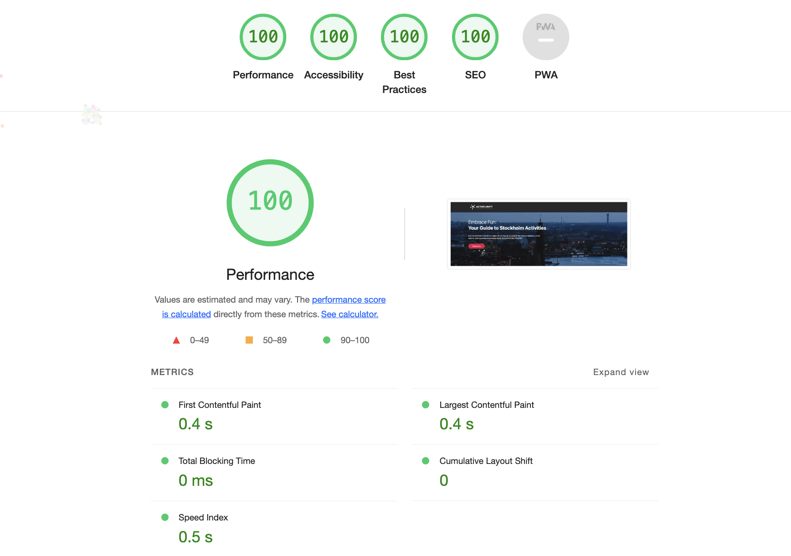
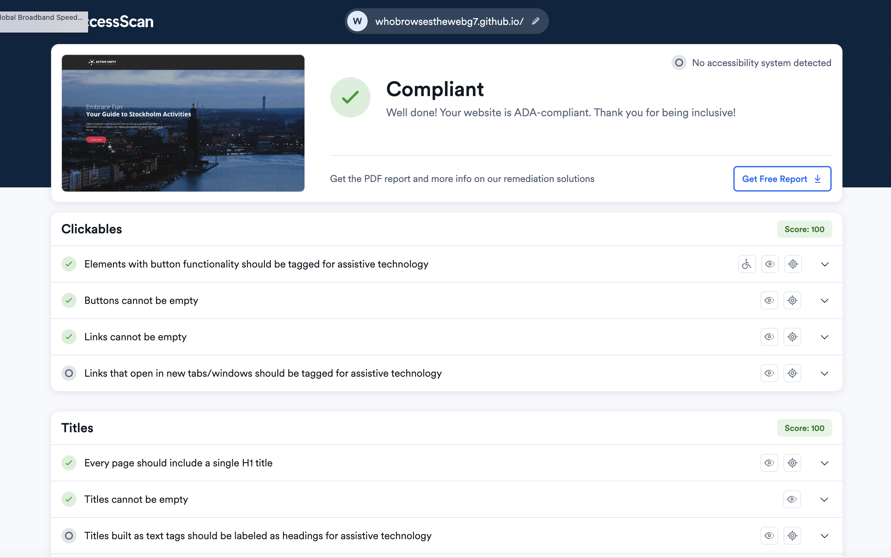

# Active Unity - SEO School Project

## Table of Contents

- [Overview](#overview)
- [Project Contributors](#project_contributors)
- [School Information](#school_information)
- [Project Screenshots](#project_screenshots)
- [Features](#features)

## Overview

Active Unity is a website for local community events. This site could cater to residents within a specific area, offering information on upcoming events, workshops, and community meetings. The target audience is local residents of all ages interested in community engagement.

## Project Contributors

1. Hassen Ahmed
2. Simon Rosengren
3. Daniel Pettersson
4. Jinjing Wu
5. Kseniia Tikhonova

## School Information

School Name: Hyper Island

## Project Screenshots

### Website Overview

### Metrics Performance (Lighthouse)

### Metrics Performance (Accessibe.com)

### Links

- Solution URL: https://github.com/whobrowsesthewebg7/active-unity
- Live Site URL: https://whobrowsesthewebg7.github.io/active-unity/

## Features

**React App:** Active Unity is built using React, providing a dynamic and responsive user interface.

**Mobile-First Design:** The website is optimized for mobile devices, ensuring a seamless experience for users on various screen sizes.

**Tailwind CSS:** Tailwind CSS is utilized for styling, allowing for efficient and consistent design implementation.

## Target Audience

Active Unity is tailored for the local residents of Stockholm. The target audience includes individuals of all ages who are interested in actively participating in community events, workshops, and meetings. The platform serves as a centralized hub for residents to discover and engage in activities within their specific area.

## Additional Notes

- For the best experience, use the latest version of modern web browsers.
- Ensure a stable internet connection for real-time updates and data retrieval.

Feel free to explore, contribute, and enhance Active Unity to further enrich the local community experience in Stockholm. If you have any questions or feedback, please contact the project contributors listed above.
